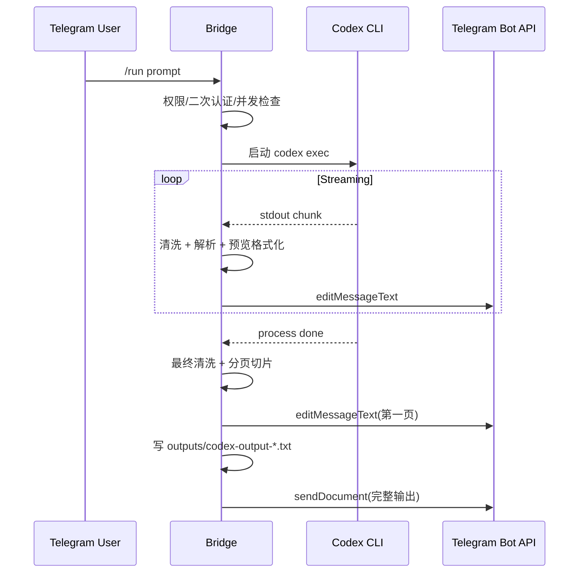

# AGENTS.md

本文档用于说明 `tg-codex` 的核心业务逻辑、处理链路、关键约束与扩展方式，方便后续维护与二次开发。

## 1. 项目目标

`tg-codex` 是一个 Telegram -> Codex CLI 的桥接服务：

1. 用户在 Telegram 发送命令/文本/图片请求。
2. 服务调用本地 Codex CLI 执行任务。
3. 运行中以单条消息持续编辑展示进度。
4. 结束后分页展示结果，并上传完整输出文件。

---

## 2. 运行架构

### 2.1 入口层（FastAPI + Telegram Application）

- `main.py`：启动入口。
- `app_factory.py`：构建 FastAPI 与 telegram `Application`，注册全部 handler。
- 支持两种模式：
  - Webhook（配置 `TG_WEBHOOK_URL` + `TG_WEBHOOK_SECRET`）
  - Long polling（未配置 webhook 时）

### 2.2 核心业务层（Bridge）

- 文件：`bridge.py`
- 主要职责：
  - 权限校验
  - 命令管理（含 session resume）
  - 流式执行与实时预览
  - 输出清洗、diff/exec 识别、分页渲染
  - 最终输出文件落地与上传

### 2.3 执行层（Codex Runner）

- 文件：`codex_runner.py`
- 主要职责：
  - 校验 Codex 命令前缀合法性
  - 启动子进程并按行流式读取输出
  - 统一超时控制、取消处理、非 0 退出错误转换

---

## 3. 核心数据结构

### 3.1 `PageSession`

用于 Telegram 分页状态管理：

- `chat_id`
- `message_id`
- `pages`
- `created_at`
- `last_access`
- `current_index`

### 3.2 `TraceSection`

用于解析结构化 trace 输出片段：

- `marker`：如 `assistant` / `codex` / `thinking` / `exec`
- `lines`：该 section 的正文行
- `content`：拼接后的正文

---

## 4. 输入处理链路

### 4.1 指令入口

- `/run <prompt>`：执行任务
- 普通文本（可选开关 `TG_ALLOW_PLAIN_TEXT=1`）：按 prompt 执行
- 图片消息：下载后生成包含本地图片路径的 prompt，再执行

### 4.2 权限与二次认证

每次执行前按顺序校验：

1. `chat_id` 在允许列表
2. `user_id` 在允许列表
3. 管理命令需 admin chat + admin user
4. 若配置 `TG_AUTH_PASSPHRASE`，需先 `/auth` 通过（TTL 可配置）

### 4.3 防抖与并发控制

- 请求去重：同一 `(chat_id, message_id)` 在去重窗口内不重复执行
- 单聊天串行：同一 chat 同时只能跑一个任务
- 全局并发：受 `TG_MAX_CONCURRENT_TASKS` 限制

---

## 5. Codex 命令解析与会话恢复

### 5.1 命令前缀校验

`_validate_codex_prefix` 强约束：

- 必须是 codex 可执行程序
- 必须包含 `exec`
- 不允许 `--dangerously-skip-permissions`
- 审批模式必须是 `never`

### 5.2 会话续跑策略

每个 Telegram chat 维护一个 `session_id`：

- 若 chat 存在 session，构建 `exec resume <session_id> <prompt>`
- 若不存在或不满足续跑结构，走新会话命令
- 任务完成后从输出中提取最新 `session id` 并持久化

---

## 6. 流式执行与实时更新

### 6.1 流式读取

- 子进程 stdout/stderr 合并读取
- 按行 `yield`
- 心跳空串用于驱动“thinking/运行中”状态刷新

### 6.2 输出缓冲

- 累积 `output`
- 超过 `TG_MAX_BUFFERED_OUTPUT_CHARS` 后保留尾部，避免内存过高
- 若触发截断，最终输出前增加 `[output truncated for safety]`

### 6.3 编辑节流

- 按 `EDIT_THROTTLE_SECONDS` 控制消息编辑频率
- 降低 Telegram 限流风险

---

## 7. 预览生成逻辑（重点）

预览链路目标：**优先给用户最有价值的最新片段，且显示稳定可读**。

### 7.1 清洗阶段

`_clean_output`：

- 去 ANSI 控制符
- 统一换行
- 去 NUL 字符
- 连续重复行去重

### 7.2 Trace 解析阶段

`_parse_trace_sections`：

- 识别多种 marker 写法：
  - `assistant`
  - `assistant:`
  - `role: assistant`
  - `[trace] assistant:`
  - `tool: exec`
- 遇到 `tokens used` 或新 marker 结束当前段
- 过滤噪声行（版本、模型信息、分隔线等）

### 7.3 运行中片段选择策略

优先选最新 section：

1. `assistant/codex` -> 直接做内容标准化展示
2. `thinking` -> 展示 thinking 摘要 + 动态 spinner
3. `exec` -> 按 exec 逻辑渲染（优先代码块）

### 7.4 完成态片段选择策略

优先顺序：

1. 最新 `assistant/codex`
2. 最新 `exec`
3. 回退到全量过滤后的正文

---

## 8. diff 识别与标准化（重点）

### 8.1 apply_patch 转 diff

当输出含 `*** Begin Patch` 时：

- 解析 `Update/Add/Delete/Move`
- 组装统一 `diff --git` / `---` / `+++` 头
- 仅保留 hunk 相关行（`@@`, `+`, `-`, ` `）

### 8.2 diff 自动识别

`_looks_like_unfenced_diff` 采用“候选窗口 + 指标评分”：

- 指标统计：
  - header 命中（`diff --git`, `---`, `+++`, `@@`, `rename from/to` 等）
  - body 命中（`+`/`-`）
  - hunk 是否存在
  - diff 行密度
- 支持“前置解释文本 + diff 正文”的场景（从 header 起构造 tail 窗口）
- 显著降低误判：普通列表 `+/-` 不会轻易被识别为 diff

### 8.3 diff 代码块策略

- 已有围栏时可自动 retag 为 ```diff
- 嵌入式 diff 会补 fenced block
- 纯 diff 文本自动包裹成 ```diff

---

## 9. exec 识别与展示（重点）

### 9.1 exec 段识别

来自 trace marker `exec`（含扩展写法）后续正文。

### 9.2 exec 渲染策略

- 先走统一内容标准化（含 diff 检测）
- 若未被 fenced：
  - 第一行像 shell 命令（`git`, `python`, `bash`, 带管道/重定向等）
  - 则渲染为 ```bash
  - 否则渲染为普通 ```

---

## 10. Telegram 显示优化

### 10.1 运行中展示

- thinking 态：spinner + 运行时长 + 细节摘要
- 普通 running 态：顶部显示 `running mm:ss` + 预览正文

### 10.2 最终展示

- 输出按语义分段并按长度切片（尽量不破坏 fenced 结构）
- 多页输出支持 `‹ Prev` / `Next ›`
- 页头显示 `Page x/y`
- 分页状态带 TTL，过期自动失效

---

## 11. 完整输出文件处理（重点）

每次任务完成都会执行：

1. 生成输出文件名：`codex-output-{chat_id}-{message_id}-{timestamp}.txt`
2. 写入本地目录：`outputs/`
3. 设置权限（目录 700、文件 600，尽力而为）
4. 上传 Telegram 文档消息
5. 若上传失败：保留本地文件并通知失败原因与本地路径

---

## 12. 异常与取消语义

- 用户 `/cancel`：取消 asyncio task，子进程 kill，消息更新为已取消
- 执行异常：消息更新为 `Task failed` + 原因
- 输出文件上传异常：不影响主任务成功，单独通知
- 临时图片文件：任务结束后总是清理（finally）

---

## 13. 配置项速查（关键）

- `TG_BOT_TOKEN`：必填
- `TG_ALLOWED_CHAT_IDS` / `TG_ALLOWED_USER_IDS`：必填白名单
- `TG_ADMIN_CHAT_IDS` / `TG_ADMIN_USER_IDS`：管理权限范围
- `CODEX_COMMAND_PREFIX`：Codex 命令前缀
- `CODEX_TIMEOUT_SECONDS`：执行超时
- `TG_MAX_BUFFERED_OUTPUT_CHARS`：内存输出上限
- `TG_MAX_CONCURRENT_TASKS`：全局并发
- `TG_AUTH_PASSPHRASE` / `TG_AUTH_TTL_SECONDS`：二次认证

---

## 14. 维护建议

1. 修改输出解析逻辑时，优先维护 `TraceSection` 和 `_sanitize_output_for_preview` 的职责边界。
2. 新增 trace marker 时，同时更新：
   - `TRACE_SECTION_MARKERS`
   - `_normalize_trace_marker`
3. 修改 diff 规则时，先看误判风险（普通列表、日志符号行）。
4. Telegram 文本长度变化需同步检查：
   - 流式消息限制
   - 分页切片上限
5. 对外行为变更需同步更新 `README.md`。

---

## 15. 简化时序图


